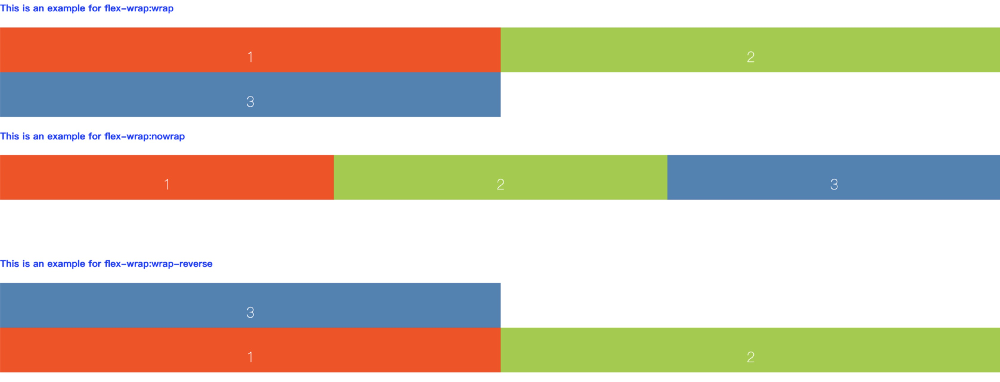

# flex布局

弹性盒布局模型

交叉轴:垂直于主轴  

设置为flex容器:display:flex;  

任何一个容器都可以指定为Flex布局。行内元素也可以使用Flex布局。注意，设为Flex布局以后，子元素的float、clear和vertical-align属性将失效。

采用Flex布局的元素，称为Flex容器（flex container），简称"容器"。它的所有子元素自动成为容器成员，称为Flex项目（flex item），简称"项目"。

容器默认存在两根轴：水平的主轴（main axis）和垂直的交叉轴（cross axis），项目默认沿主轴排列。

一个容器默认有两条轴，一个是水平的主轴，一个是与主轴垂直的交叉轴。我们可以使用flex-direction来指定主轴的方向。我们可以使用justify-content来指定元素在主轴上的排列方式，使用align-items来指定元素在交叉轴上的排列方式。还可以使用flex-wrap来规定当一行排列不下时的换行方式。

## flex容器元素属性

### flex-direction

flex-direction: row[默认] | row-reverse | column | column-reverse

属性决定主轴的方向（即项目的排列方向）。

### flex-wrap

flex-wrap:[wrap | nowrap] 换行策略，是否自动换行，是否超出缩放，溢出;

```html
<h4>This is an example for flex-wrap:wrap </h4>
<div class="content">
  <div class="red">1</div>
  <div class="green">2</div>
  <div class="blue">v3</div>
</div>
<h4>This is an example for flex-wrap:nowrap </h4>
<div class="content1">
  <div class="red">1</div>
  <div class="green">2</div>
  <div class="blue">3</div>
</div>
<h4>This is an example for flex-wrap:wrap-reverse </h4>
<div class="content2">
  <div class="red">1</div>
  <div class="green">2</div>
  <div class="blue">3</div>
</div>
```

```css
/* Common Styles */
.content,
.content1,
.content2 {
  color: #fff;
  font: 100 24px/100px sans-serif;
  height: 150px;
  text-align: center;
}
.content div,
.content1 div,
.content2 div {
  height: 50%;
  width: 50%;
}
.red {
  background: orangered;
}
.green {
  background: yellowgreen;
}
.blue {
  background: steelblue;
}
/* Flexbox Styles */
.content {
  display: flex;
  flex-wrap: wrap;
}
.content1 {
  display: flex;
  flex-wrap: nowrap;
}
.content2 {
  display: flex;
  flex-wrap: wrap-reverse;
}
```



### flex-flow

flex-flow :flex-direction flex-wrap; 简写;  

### align-content

值: flex-start | flex-end | center | space-between | space-around | stretch

align-content: ;定义了多根轴线的对齐方式。如果项目只有一根轴线，该属性不起作用。  

align-content属性只适用于多行的flex容器

### justify-content

值:flex-start | flex-end | center | space-between |space-around | initial;

主轴上，元素之间及其周围的空间.元素如何排列，以及空间隔  

### align-items

align-items; 定义项目在交叉轴上如何对齐。  

值：

- flex-start |
- flex-end |
- center |
- baseline |
- stretch 填充满列高度

align-items和align-content有相同的功能，不过不同点是它是用来让每一个单行的容器居中而不是让整个容器居中。

## flex子元素属性

flex item  

<https://developer.mozilla.org/zh-CN/docs/Web/CSS/flex>

### order

[number] 定义项目的排列顺序。数值越小，排列越靠前，默认为0。

### flex

flex-grow flex-shrink flex-basis;简写;规定了弹性元素如何伸长或缩短以适应flex容器中的可用空间

### flex-basis  

布局空白的基准值  指定了 flex 元素在主轴方向上的初始大小

### flex-grow

[number] ;定义项目的放大比例，默认为0，即如果存在剩余空间，也不放大。

### flex-shrink

[number] ;flex 元素的收缩规则,flex 元素仅在默认宽度之和大于容器的时候才会发生收缩，其收缩的大小是依据 flex-shrink 的值;

## flex子元素不超出容器做法

```css
/* 子元素 */
flex:auto;
overflow:hidden;

/* 或者 */
flex:auto;
width:0;
```

## flex高度问题

这样可以让元素获取高度。这样子元素100%可以拿到高度.

```
flex-grow:1
overflow: hidden;
```
