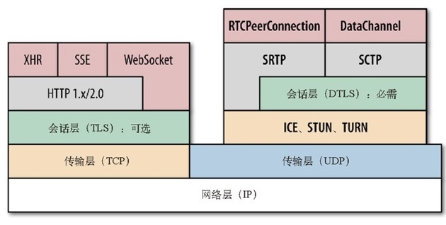

# WEB性能优化

参考《Web性能权威指南》

***

## 带宽和延迟

延迟影响因素最大

**Ookla测宽带**

<http://speedtest.net>

## 传输层安全（TLS）

SSL(Secure Sockets Layer,安全套接字层)。

SSL不会影响上层协议（如HTTP，电子邮件，即时通讯），但能够保证上层协议的网络通信安全。

TSL1.0 也就是 SSL3.0 的升级版

1. 应用层（HTTP...）
2. 会话层 (TLS)
3. 传输层(TCP)
4. 网络层(IP)
5. 数据链路层
6. 物理层

### 加密，身份验证，完整性

加密：混淆数据的机制

身份验证：验证身份标识有效性的机制

完整性：检测消息是否被篡改或伪造的机制

### TLS握手

每个TLS连接在TCP握手基础上最多还需要两次额外的往返。

- **公钥与对称密钥加密：**

公钥加密系统只在建立TLS信道的会话中使用。  
在此期间服务器向客户端提供它的公钥，  
客户端生成密钥并使用服务器的公钥对其加密。然后讲加密的对称密钥返回给服务器  
服务器用自己的私钥解密出客户端发来的对称密钥

- HTTP通常是80端口，TLS是443端口

- ALPN(应用层协议协商)：作为TLS的扩展，让我们能在TLS握手的同时协商应用协议，从而省掉了HTTP的Upgrade机制所需的额外往返时间。

- 网络上可以建立TCP连接的任意两端都可以建立加密TLS信道，客户端只需知道另一段的IP地址，即可建立连接并进行TLS握手。

### TLS会话恢复

### 信任链与证书颁发机构

### 证书撤销

### TLS记录协议

与位于其下的IP或TCP层没有什么不同，TLS会话中交换的所有数据同样使用规格明确的协议进行分帧。TLS记录协议负责识别不同的消息类型（握手，警告或数据，通过“内容类型”字段），以及每条消息的安全和完整性验证。

### 针对TLS优化建议

#### 计算成本

SSL/TSL计算只占CPU负载的不到1%。  
以及不到2%的网络资源  
SSL/TSL计算已经不是问题了

- 要把SSL库升级到最新版本，在此基础上再构建Web服务器和代理服务器。最新的OpenSSL在性能方面有了明显的提升。

#### 今早完成(握手)

简言之：把服务器放到接近客户端的地方能够节约TCP和TLS握手的时间！

#### 会话缓存与无状态恢复

SSL2.0引入的会话表示符机制是TLS会话缓存的基础，目前已经得到大多数客户端和浏览器的广泛支持。

#### TLS记录大小

小记录会造成浪费，大记录会导致延迟。

#### TLS压缩

禁用TLS压缩，应该使用服务器的Gzip设置压缩所有文本资源，同时对图像，视频，音频等媒体采用最合适的压缩格式。

#### 证书链的长度

#### OCSP封套

#### HTTP严格传输安全（TSTS）

### TLS性能清单

- 要最大限制提升TCP性能
- 把TLS库升级到最新版本
- 启动并配置会话缓存和无状态恢复
- 监控会话缓存的使用情况并作出相应调整
- 在接近用户的地方完成TLS会话，尽量减少往返延迟
- 配置TLS大小，使其恰好能封装在一个TCP段内
- 确保证书链不会超过拥塞窗口的大小
- 从信任链中去掉不必要的证书，减少链条层次
- 禁用服务器的TLS压缩功能
- 启用服务器对SNI的支持
- 启用服务器的OCSP封套功能
- 追加HTTP严格传输安全首部

## 无线网络

### 类型

- 个人局域网(PAN)

个人活动范围；替代周边设备的线缆；蓝牙，ZigBee，NFC

- 局域网（LAN）

一栋楼或校园内；有线网络的无线扩展；IEEE 802.11（Wi-Fi）

- 城域网（MAN）

一座城市内；无线内联网；IEEE802.15（WiMax）

- 广域网（WAN）

世界范围内；无线网络；蜂窝（UMTS ， LTE等）

### 性能

- 带宽

无线落网是电磁辐射。发送端和接收端必须事先就通信使用的频率范围达成共识。  
影响性能的最主要因素就是频率范围的大小（带宽）。  
在其他条件等同的情况下，频率范围加倍，传输速度加倍。  
低频信号传输距离远，覆盖范围广（大蜂窝），但要求天线更大。高频信号能传输更多数据，但传输距离不远，覆盖范围小，需要较多的基础设施。

- 信号强度

收发两端之间的信号强度，信噪比（SNR，Signal Noise Ratio）；

- 调制

- 影响无线网络性能的因素：

1. 首发端的距离  
1. 当前位置的背景噪声大小  
1. 来自同一网络其他用户的干扰大小  
1. 来自相邻网络其他用户的干扰大小
1. 两端发射功率大小
1. 处理能力及调制算法

如果对性能要求十分苛刻，干脆使用有线

## Wi-Fi

- 网络层次

2.数据链路层：  
802.2逻辑链路控制层（LLC）  
802.2MAC

1.物理层  
802.3以太网  
802.11b Wi-Fi  
802.11g Wi-Fi  
802.11n Wi-Fi  
。。。

- 高负载下性能不稳定的Wi-Fi网络很常见，比如某个技术大会现场，访问同一节点的客户端很多，这时候的Wi-Fi网络很可能就不稳定。当然，概率调度并不是造成这种结果的唯一因素，但无疑是其中之一。

- Wi-Fi网络的广泛部署和流行也导致了最大的一个性能挑战：小区内部和外部干扰。

- 802.11g客户端和路由器的速度可能是54Mbits/s,如果邻居也占用相同Wi-Fi信道，带宽会减至一半；  
新的802.11n和802.11ac标准使用的5GHz频段，拓宽了频率范围，能够保证在多数环境下不发生冲突。

- 运行ping命令可以估计网络第一跳延迟时间

- 关于Wi-Fi性能的重要因素：  
Wi-Fi不保证用户的带宽和延迟时间  
Wi-Fi的信噪比不同，带宽也随之不同  
Wi-Fi的发射功率被限制在200mW以内  
Wi-Fi在2.4GHz和较新的5GHz频段中的频谱有限  
Wi-Fi信道分配决定了接入点信号会重叠  
Wi-Fi接入点与客户端争用同一个无线信道

## 移动网络

### G字号移动网络

- 活动移动连接的数据速率和延迟时间  

代  数据速率  ，   延迟时间  
2G，100-400Kbit/s，300-1000ms  
3G，0.5-5Mbit/s，100-500ms  
4G，1-50Mbit/s，<100ms

### 移动网络的优化建议

## web性能要点

### 时间

时间 ：     感觉

0-100ms：  很快

100-300ms：有一点点慢

300-1000ms：机器在工作呢

>1000ms:先干点别的吧
>10000ms:不能用了

### 请求构成

每个http请求都由很多独立的阶段构成：

DNS解析，TCP链接握手，TLS协商（必要时）发送http请求，下载内容

### 资源瀑布图

### 延迟是性能瓶颈

> 如果延迟对大多数有线链接是限制性能的因素，那可想而知，它对无线客户端将是更重要的性能瓶颈。事实上，无线延迟明显更高，因此网络优化是提升移动web应用性能的关键。
> 增加带宽没有那么重要

### 针对浏览器的优化

- 基于文档的优化：优先获取资源

- 推测性优化：预先解析DNS，预先连接可能的目标

页面结构和交付

- css和JavaScript等重要资源应该尽早在文档中出现

- 应该尽早交付css，从而解除渲染阻塞并让javascript执行

- 非关键性JavaScript应该推迟，以避免阻塞DOM和CSSOM构建

- HTML文档由解析器递增解析，从而保证文档可以间歇性发送，以求得最佳性能。

## HTTP2.0

...

## 优化交付

影响绝大多数Web应用性能的并非带宽，而是延迟。网速越来越快，但延迟似乎并没有缩短

经典的性能优化最佳实践：

**减少DNS查找**  

每一次主机名解析都需要一次网络往返，从而增加请求的延迟时间，同时还会阻塞后续请求。

**重用TCP连接**  

尽可能使用持久连接，以消除TCP握手和慢启动延迟；

**减少HTTP重定向**

HTTP重定向极费时间，特别是不同域名之间的重定向，更加费时；这里面既有额外的DNS查询，TCP握手，还有其他延迟。最佳的重定向次数为零。

**使用CDN（内容分发网络）**  

**去掉不必要的资源**

任何请求都不如没有请求

**在客户端缓存资源**

- 保证首部包含适当的缓存字段：

  Cache-Control：指定缓存时间  
  Last-Modified和Etag首部提供验证机制

- 图片合适的有损压缩

  WebP是谷歌开发的一种新图片格式

**传输压缩过的内容**  

传输资源采用最好的压缩手段

**消除不必要的请求开销**

减少请求的HTTP首部数据（比如HTTP cookie），节省的时间相当于几次往返的延迟时间。

- HTTP是无状态协议

- RFC2965扩展：允许任何网站针对自身来源关联和更新cookie元数据；浏览器保存数据，而在随后发送给来源的每一个请求的cookie首部中自动附加这些信息。  
浏览器会自动附加关联的cookie数据；  
HTTP1.x下，包括cookie在内的HTTP首部都会在不压缩的状态下传输；

- 大多数浏览器限制cookie大小4KB

**并行处理请求和响应**

- 使用持久连接，从HTTP1.0升级到1.1
- 利用多个HTTP1.1实现并行下载
- 可能的情况下利用HTTP1.1管道
- 考虑升级到HTTP2.0
- 确保服务器有足够的资源并行处理请求

**针对协议版本采取优化措施**

HTTP 1.x支持有限的并行机制，要求打包资源，跨域分散资源，等等。相对而言，HTTP2.0只要建立一个连接就能实现最佳性能，同时无需针对HTTP1.x的那些优化方法。

## XMLHttpRequest

见 主页 Ajax.md

## 服务器发送事件（SSE）

Server-Sent Event(SSE)：让服务器可以向客户端流式发送文本消息。

SSE的两个组件：  
1.浏览器中的EventSource  
2.新的“事件流”数据格式

SSE的特点：  
通过一个长连接低延迟交付  
高效的浏览器消息解析，不会出现无限缓冲  
自动跟踪最后看到的消息及自动重新连接  
消息通知在客户端以DOM事件形式呈现

**EventSource API**

```js
var source = new EventSource("/path/to/stream-url");
source.onopen = function(){
  //...
}
source.onerror = function(){
  //...
}
//监听foo事件 使用自定义代码
source.addEventListener("foo", function(event){
  processFoo(event.data);
})

source.onmessage = function(event){
  log_message(event.id,event.data);
  if(event.id == "CLOSE") {
    source.close();
  }
}
```

> 目前大多数浏览器支持，IE和Opera Mini不支持
> 有腻子脚本可以在XHR基础上实现在不支持的浏览器使用EventSource。有库可以选择。比如jQuery.EventSource使用XHR轮询模拟SSE

**Event Stream 协议**

SSE事件流是以流式HTTP响应形式交付的。  
客户端发起常规HTTP请求，服务器以自定义的“text/event-stream”内容类型响应，然后交付UTF-8编码的事件数据。

```
//请求
GET /stream HTTP/1,1
Host: example.com
Accept: text/event-stream

//响应
HTTP/1.1 200 OK
Connection: keep-alive
Connection-type: text/event-stream
Transfer-Encoding: chunked
//中断后重新连接的时间
retry: 15000
//不带消息类型的简单文本
data: First message is a simple string
//不带消息类型的JSON数据
data:{"message":"23131"}
//类型为foo的简单文本
event: foo
data: Message of type foo
//带消息类型和ID的多行文本
id: 42
event: bar
data: Multi-line message of
data: type "bar" and id "42"

id:43
data:Last message, id "43"

```

> SSE连接是UTF-8编码，本质上是HTTP流式响应，是可以压缩的

**SSE使用场景以及性能**

> 两个局限：  
1.只能从服务器向客户端发送数据，不能满足需要请求流的场景（比如向服务器流式上传大文件）  
2.事件流协议设计为只能传输UTF-8数据，即使可以传输二进制流，效率也不高

## WebRTC

Web Real-Time Communication (Web实时通信，WebRTC)由一组标准，协议和Javascript API组成，用于实现浏览器之间（端到端）的音频，视频及数据共享。

浏览器关于音频视频等高品质应用对应的API：  
MediaStream 获取音频和视频流  
RTCPeerConnection 音频和视频数据通信  
RTCDataChannel 任意应用数据通信

WebRTC通过UDP传输数据，不过UDP只是个起点。

**标准和WebRTC发展**

- W3C的Web Real-Time Communications（WEBRTC）Working Group 负责制定浏览器API

- IETF的Real-Time Communication in Web-browsers（RTCWEB）定义协议，数据格式，安全及其他在浏览器中实现端到端通信必需的内容

**音频和视频引擎**

- W3C的Media Capture and Streams规范规定了一套新的Javascript API，应用可以通过这套API从平台取得音频和视频流，并对他们进行操作处理。MediaStream是该功能主要接口。

- getUserMedia() API：  
负责获准访问用户的麦克风和摄像机。并获取符合指定要求的流。是从底层平台取得视频和音频流的简单API。得到的媒体都经过WebRTC音频和视频引擎的自动优化，编码，解码，然后就可以输出到各种目的地。

- 取得流后，可以将它们提供给其他浏览器API：  
通过Web Audio API在浏览器中处理音频  
通过Canvas API 采集个别视频帧并加以处理  
通过CSS3和WebGL API为输出的流应用各种2D/3D特效。

- 音频（Opus） 视频（VP8）比特率：  
WebRTC实现使用Opus和VP8编解码器。单方高清音视频流最多需要2.5Mbit/s以上的带宽。如果是多方视频通话，考虑到要额外占用带宽，CPU和GPU及内存资源，就必须降低品质

**实时网络传输**

- 因为及时性的要求高于可靠性。所以UDP协议才更适合用于传输实时数据。TCP适合传输可靠的，有序的数据流。

- 相对TCP，UDP的特点：  
不保证消息交付：不确认，不重传，无超时  
不保证交付顺序：不设置包序号，不重排，不会发生队首阻塞  
不跟踪链接状态：不必建立连接或重启状态机  
不需要拥塞控制：不内置客户端或网络反馈机制

- WebRTC的协议分层



**RTCPeerConnection API简介**

1. RTCPeerConnection 管理穿越NAT的完整ICE工作流
2. 发送自动（STUN）持久化信号
3. 跟踪本地流
4. 跟踪远程流
5. 按需触发自动流协商
6. 提供必要的API，以生成连接提议，接收应答，允许我们查询连接的当前状态，等等，

**DataChannel**

**建立端到端的连接**
