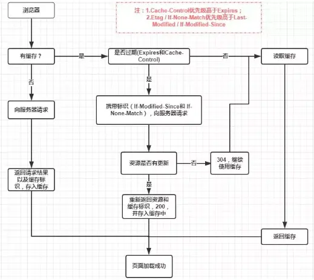

# 缓存

<https://www.jianshu.com/p/54cc04190252>

<https://juejin.im/post/6844903672556552205#heading-3>

<https://juejin.cn/post/6855469171703185416#heading-8>

web 资源的缓存策略一般由服务器来指定

缓存策略分为两种：强缓存和协商缓存

并且缓存策略都是通过设置 HTTP Header 来实现的。

## 缓存位置

- Service Worker

- Memory Cache

- Disk Cache

- Push Cache

## 浏览器缓存机制

浏览器再向服务器请求资源时,首先判断是否命中强缓存,再判断是否命中协商缓存!

```
1）判断强缓存是否命中：

浏览器在加载资源时，先根据这个资源的一些http header判断它是否命中强缓存，强缓存如果命中，浏览器直接从自己的缓存中读取资源，不会发请求到服务器。比如：某个css文件，如果浏览器在加载它所在的网页时，这个css文件的缓存配置命中了强缓存，浏览器就直接从缓存中加载这个css，连请求都不会发送到网页所在服务器；

2）强缓存未命中时，判断协商缓存是否命中：

当强缓存没有命中的时候，浏览器一定会发送一个请求到服务器，通过服务器端依据资源的另外一些http header验证这个资源是否命中协商缓存，如果协商缓存命中，服务器会将这个请求返回，但是不会返回这个资源的数据，而是告诉客户端可以直接从缓存中加载这个资源，于是浏览器就又会从自己的缓存中去加载这个资源；
```

强缓存与协商缓存的共同点是：如果命中，都是从客户端缓存中加载资源，而不是从服务器加载资源数据；区别是：强缓存不发请求到服务器，协商缓存会发请求到服务器。

当协商缓存也没有命中的时候，浏览器直接从服务器加载资源数据。

强制缓存优先于协商缓存进行

若强制缓存(Expires和Cache-Control)生效则直接使用缓存

若不生效则进行协商缓存(Last-Modified / If-Modified-Since和Etag / If-None-Match)

协商缓存由服务器决定是否使用缓存，若协商缓存失效，那么代表该请求的缓存失效，返回200，重新返回资源和缓存标识，再存入浏览器缓存中；生效则返回304，继续使用缓存



## 强缓存

不会向服务器发送请求，直接从缓存中读取资源，在chrome控制台的Network选项中可以看到该请求返回200的状态码，并且Size显示from disk cache或from memory cache。

强缓存是利用Expires或者Cache-Control这两个http response header实现的，它们都用来表示资源在客户端缓存的有效期。

### 1. Expires

Expires是HTTP 1.0提出的一个表示资源过期时间的header，它描述的是一个绝对时间。这个时间代表着这个资源的失效时间，在此时间之前，即命中缓存。是服务器端的具体的时间点。

由服务器返回

Expires是Web服务器响应消息头字段

在响应http请求时告诉浏览器在过期时间前浏览器可以直接从浏览器缓存取数据，而无需再次请求。

例如，一个文件的Expires值是2020年的1月1日，那么就代表，在2020年1月1日之前，浏览器都可以直接使用该文件的本地缓存文件，而不必去服务器再次请求该文件，哪怕服务器文件发生了变化。

```
Expires缓存原理:

1. 浏览器第一次跟服务器请求一个资源，服务器在返回这个资源的同时，在response的header加上Expires的header，如：

2. 浏览器在接收到这个资源后，会把这个资源连同所有response header一起缓存下来（所以缓存命中的请求返回的header并不是来自服务器，而是来自之前缓存的header）；

3.浏览器再请求这个资源时，先从缓存中寻找，找到这个资源后，拿出它的Expires跟当前的请求时间比较，如果请求时间在Expires指定的时间之前，就能命中缓存，否则就不行；

4.如果缓存没有命中，浏览器直接从服务器加载资源时，Expires Header在重新加载的时候会被更新；
```

`Expires=max-age + 请求时间`，需要和`Last-modified`结合使用。

### 2. Cache-Control

Cache-Control描述的是一个相对时间，在进行缓存命中的时候，都是利用客户端时间进行判断，所以相比较Expires，Cache-Control的缓存管理更有效，安全一些。

缓存原理与Expires类似

主要是利用该字段的 max-age 值来进行判断

- max-age：

max-age=xxx (xxx is numeric)表示缓存内容将在xxx秒后失效。

它是一个相对时间，例如 Cache-Control:max-age=3600，代表着资源的有效期是 3600 秒。

- no-cache：

客户端缓存内容，是否使用缓存则需要经过协商缓存来验证决定。需要进行协商缓存，发送请求到服务器确认是否使用缓存。

表示不使用 Cache-Control的缓存控制方式做前置验证，而是使用 Etag 或者Last-Modified字段来控制缓存。

设置了no-cache之后，并不是说浏览器就不再缓存数据，只是浏览器在使用缓存数据时，需要先确认一下数据是否还跟服务器保持一致。

- no-store：

禁止使用缓存，每一次都要重新请求数据。

- public：

所有内容都将被缓存（客户端和代理服务器CDN都可缓存）。

具体来说响应可被任何中间节点缓存，如 Browser <-- proxy1 <-- proxy2 <-- Server，中间的proxy可以缓存资源，比如下次再请求同一资源proxy1直接把自己缓存的东西给 Browser 而不再向proxy2要。

- private：

所有内容只有客户端可以缓存，Cache-Control的默认取值。

具体来说，表示中间节点不允许缓存。不允许 CDN 等中继缓存服务器对其缓存。

对于Browser <-- proxy1 <-- proxy2 <-- Server，proxy 会老老实实把Server 返回的数据发送给proxy1,自己不缓存任何数据。当下次Browser再次请求时proxy会做好请求转发而不是自作主张给自己缓存的数据。

- s-maxage（单位为s)：

同max-age作用一样，只在代理服务器中生效（比如CDN缓存）。比如当s-maxage=60时，在这60秒中，即使更新了CDN的内容，浏览器也不会进行请求。max-age用于普通缓存，而s-maxage用于代理缓存。s-maxage的优先级高于max-age。如果存在s-maxage，则会覆盖掉max-age和Expires header。

- max-stale：

能容忍的最大过期时间。max-stale指令标示了客户端愿意接收一个已经过期了的响应。如果指定了max-stale的值，则最大容忍时间为对应的秒数。如果没有指定，那么说明浏览器愿意接收任何age的响应（age表示响应由源站生成或确认的时间与当前时间的差值）。

- min-fresh：

能够容忍的最小新鲜度。min-fresh标示了客户端不愿意接受新鲜度不多于当前的age加上min-fresh设定的时间之和的响应。

### Cache-Control 和 Expires对比

两者同时存在的话，Cache-Control优先级高于Expires；

其实这两者差别不大，区别就在于 Expires 是http1.0的产物，Cache-Control是http1.1的产物。在某些不支持HTTP1.1的环境下，Expires就会发挥用处。所以Expires其实是过时的产物，现阶段它的存在只是一种兼容性的写法。

## 协商缓存

当浏览器对某个资源的请求没有命中强缓存，就会发一个请求到服务器，验证协商缓存是否命中，如果协商缓存命中，请求响应返回的http状态为304并且会显示一个Not Modified的字符串

有以下两种情况：

1. 协商缓存生效，返回304和Not Modified

2. 协商缓存失效，返回200和请求结果

实现：

### Last-Modified 和 If-Modified-Since

Last-Modified： 值是这个资源在服务器上的最后修改时间

原理：

1. 浏览器第一次跟服务器请求一个资源，服务器在返回这个资源的同时，在response的header加上Last-Modified的header，这个header表示这个资源在服务器上的最后修改时间：

2. 浏览器再次跟服务器请求这个资源时，在request的header上加上If-Modified-Since的header，这个header的值就是上一次请求时返回的Last-Modified的值：

3. 服务器再次收到资源请求时，根据浏览器传过来If-Modified-Since和资源在服务器上的最后修改时间判断资源是否有变化，如果没有变化则返回304 Not Modified，但是不会返回资源内容；如果有变化，就正常返回资源内容。当服务器返回304 Not Modified的响应时，response header中不会再添加Last-Modified的header，因为既然资源没有变化，那么Last-Modified也就不会改变

4. 浏览器收到304的响应后，就会从缓存中加载资源。

5. 如果协商缓存没有命中，浏览器直接从服务器加载资源时，Last-Modified Header在重新加载的时候会被更新，下次请求时，If-Modified-Since会启用上次返回的Last-Modified值。

### ETag 和 If-None-Match

Etag是服务器响应请求时，返回当前资源文件的一个唯一标识(由服务器生成)，只要资源有变化，Etag就会重新生成。

原理:

1. 浏览器第一次跟服务器请求一个资源，服务器在返回这个资源的同时，在response的header加上ETag的header，这个header是服务器根据当前请求的资源生成的一个唯一标识，这个唯一标识是一个字符串，只要资源有变化这个串就不同，跟最后修改时间没有关系，所以能很好的补充Last-Modified的问题：

2. 浏览器再次跟服务器请求这个资源时，在request的header上加上If-None-Match的header，这个header的值就是上一次请求时返回的ETag的值：

3. 服务器再次收到资源请求时，根据浏览器传过来If-None-Match和然后再根据资源生成一个新的ETag，如果这两个值相同就说明资源没有变化，否则就是有变化；如果没有变化则返回304 Not Modified，但是不会返回资源内容；如果有变化，就正常返回资源内容。与Last-Modified不一样的是，当服务器返回304 Not Modified的响应时，由于ETag重新生成过，response header中还会把这个ETag返回，即使这个ETag跟之前的没有变化：

4. 浏览器收到304的响应后，就会从缓存中加载资源。

### Last-modified与ETag对比

- 首先在精确度上，Etag要优于Last-Modified。
Last-Modified的时间单位是秒，如果某个文件在1秒内改变了多次，那么他们的Last-Modified其实并没有体现出来修改，但是Etag每次都会改变确保了精度；如果是负载均衡的服务器，各个服务器生成的Last-Modified也有可能不一致。

- 第二在性能上，Etag要逊于Last-Modified，毕竟Last-Modified只需要记录时间，而Etag需要服务器通过算法来计算出一个hash值。

- 第三在优先级上，服务器校验优先考虑Etag

## 实际场景应用缓存策略

1. 频繁变动的资源

```sh
Cache-Control: no-cache
```

对于频繁变动的资源，首先需要使用Cache-Control: no-cache 使浏览器每次都请求服务器，然后配合 ETag 或者 Last-Modified 来验证资源是否有效。这样的做法虽然不能节省请求数量，但是能显著减少响应数据大小。

2. 不常变化的资源

```sh
Cache-Control: max-age=31536000
```
