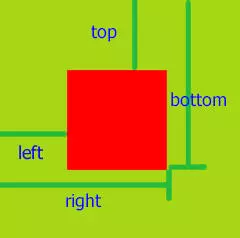

## Node


### NodeList

https://developer.mozilla.org/zh-CN/docs/Web/API/NodeList/item


## document

### createElement

https://developer.mozilla.org/zh-CN/docs/Web/API/Document/createElement

返回ELement


## Element

https://developer.mozilla.org/zh-CN/docs/Web/API/Element

> Element 是一个通用性非常强的基类，所有 Document 对象下的对象都继承自它。这个接口描述了所有相同种类的元素所普遍具有的方法和属性。一些接口继承自 Element 并且增加了一些额外功能的接口描述了具体的行为。例如， HTMLElement 接口是所有 HTML 元素的基本接口，而 SVGElement 接口是所有 SVG 元素的基础。大多数功能是在这个类的更深层级（hierarchy）的接口中被进一步制定的。


### 方法API


### 属性


### HTMLElement

HTMLElement 接口表示所有的 HTML 元素。一些HTML元素直接实现了HTMLElement接口，其它的间接实现HTMLElement接口.

继承自父接口Element和 GlobalEventHandlers的属性  

#### 元素 窗口,距离

- 元素距离视口 包括元素外部滚动  读写

Element.scrollLeft: 这个元素的顶部到视口可见内容（的顶部）的距离的度量

Element.scrollTop: 设置或获取位于对象最顶端和窗口中可见内容的最顶端之间的距离

- 元素相对于offsetParent的偏移量 只读

相对于HTMLElement.offsetParent节点的左边界偏移的像素值

HTMLElement.offsetLeft: 返回当前元素左上角相对于HTMLElement.offsetParent节点的左边界偏移的像素值

HTMLElement.offsetTop: 获取对象相对于版面或由offsetTop属性指定的父坐标的计算顶端位置

> 如果父元素设置了position属性值，只要不为static,那么 子元素.offsetParent 就是div

```html
div style="width: 300px; border-color:blue;
  border-style:solid; border-width:1;">
  <span>Short span. </span>
  <span id="long">Long span that wraps withing this div.</span>
</div>

<div id="box" style="position: absolute; border-color: red;
  border-width: 1; border-style: solid; z-index: 10">
</div>

<script>
  var box = document.getElementById("box");
  var long = document.getElementById("long"); 
  // 
  // long.offsetLeft这个值就是span的offsetLeft.
  // long.offsetParent 返回的是body（在chrome浏览器中测试）
  // 如果id为long的span元素的父元素div，设置了position属性值，只要不为static,那么long.offsetParent就是div

  box.style.left = long.offsetLeft + document.body.scrollLeft + "px";
  box.style.top = long.offsetTop + document.body.scrollTop + "px";
  box.style.width = long.offsetWidth + "px";
  box.style.height = long.offsetHeight + "px";
</script> 
```

- 元素本身 包括元素内部滚动 只读

offsetHeight: 返回该元素的像素高度，高度包含该元素的垂直内边距和边框，且是一个整数。

offsetWidth: 获得对象的可视区域的宽度，包括边框

- 元素内部 只读

对于没有定义CSS或者内联布局盒子的元素为0，否则，它是元素内部的高度(单位像素)，包含内边距，但不包括水平滚动条、边框和外边距

clientHeight: 获得对象边框内部分的高度

clientWidth: 获得对象边框内部分的宽度


- 元素本身 只读

一个元素顶部边框的宽度（以像素表示）。不包括顶部外边距或内边距。

clientTop: 获取元素顶部边框宽度

clientLeft: 获取对象左侧边框宽度

- 元素本身 包括滚动 只读

Element.scrollWidth: 表示元素内容的宽度，包括由于滚动而未显示在屏幕中内容

Element.scrollHeight: 获取对象的滚动高度。

#### getBoundingClientRect()

element.getBoundingClientRect()



https://www.jianshu.com/p/824eb6f9dda4


- left

- right 

- top

- bottom 

- width

- height